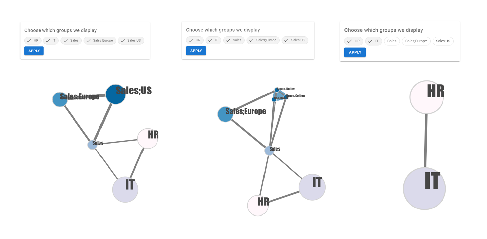
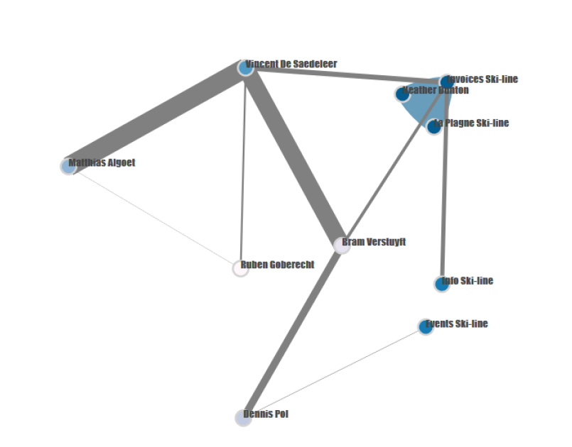

# internal-email-communication-graph

This is a part of Nabla, written as an independent Vue.js component using D3.js to visualise the graph.

Nabla is a platform that monitors email behavior in a company. Using a limited amount of data (so that privacy is respected)
statistics are provided to employees. A feedback system makes it possible to share these statistics with supervisors.
Additionally, outliers in the email behavior are detected and reported to the employee. All these features are also available on
a higher level (e.g. departments) and are provided to managers.

